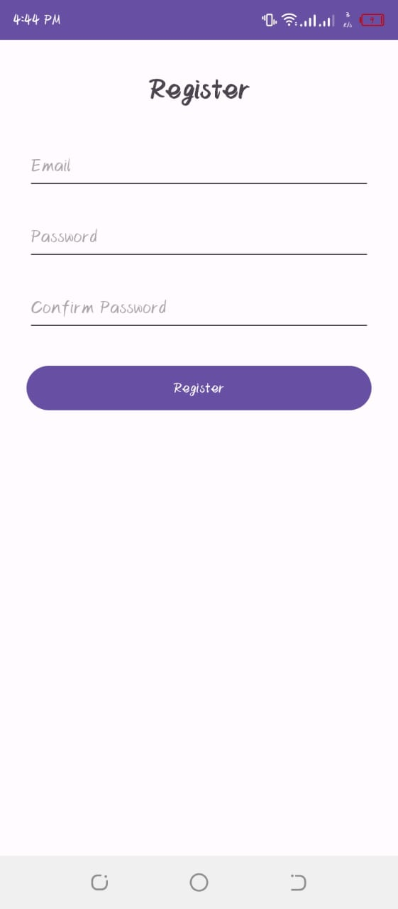
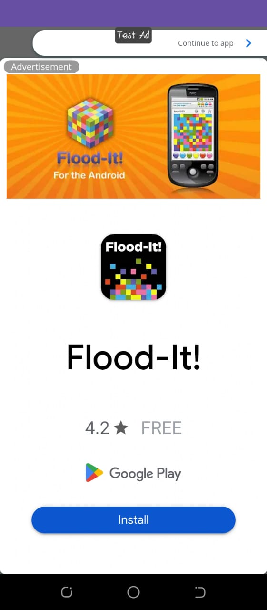
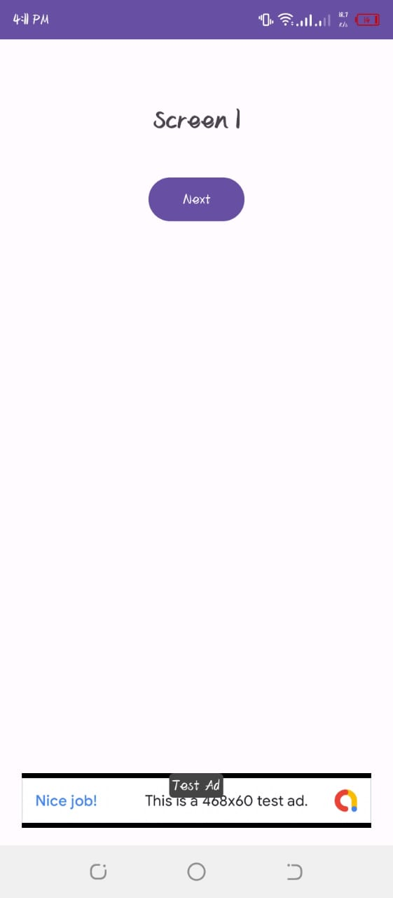
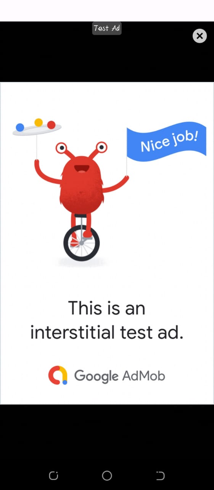
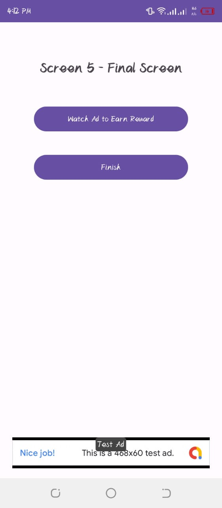

## AdsApp - AdMob Integration with Firebase
AdsApp is an Android application developed in Android Studio that demonstrates the implementation of real-world app monetization techniques using Google AdMob with Firebase Realtime Database.

## Features
•	5-screen app (excluding splash screen).
•	Open Ad implementation after splash screen following Play Store guidelines.
•	Banner Ads on the bottom of every screen except splash screen.
•	Interstitial Ad shown after the 3rd screen (if loaded).
•	Clean and intuitive login/register interface.
•	Firebase Realtime Database for storing Ad IDs.
## Technical Requirements
•	Developed using Android Studio.
•	XML for UI.
•	Java for backend implementation.
•	AdMob Test Ad IDs used during development.
•	Proper internet connectivity handling (slow/fast).
•	Error handling to avoid app crashes.

## 🖼️ Screenshots

<table>
  <tr>
    <th>Register</th>
    <th>Login</th>
    <th>Open_Ads</th>
  </tr>
  <tr>
    <td></td>
    <td></td>
    <td></td>
  </tr>
</table>

<table>
  <tr>
    <th>Banner_Ads</th>
    <th>Interstitial</th>
    <th>Reward</th>
  </tr>
  <tr>
    <td></td>
    <td></td>
    <td></td>
  </tr>
</table>

## Policies & Compliance
This project follows Google Play and AdMob policies for ad placement and user experience. All ads are shown in compliance with guidelines to avoid accidental clicks. No personal user data is stored or misused.
## License
This project is licensed under the [MIT License](LICENSE).
 - you are free to use, modify, and distribute this project as long as you include the original license notice.

